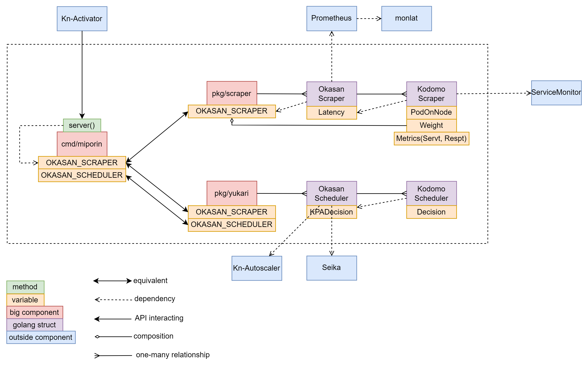

# Miporin - みぽりん - the extra controller of ikukantai

[](https://www.apache.org/licenses/LICENSE-2.0)


`miporin`-chan is the extra controller of `ikukantai`, working alongside with and is independent of Knative's controller


## 1. Motivation

To achieve the [goals](https://github.com/bonavadeur/ikukantai?tab=readme-ov-file#1-motivation) set by the `ikukantai` fleet, in addition to modifying Knative's source code, we needed a component acts as a controller that exploits the refined code inside Knative. In theory, we can develop additional logic in Knative's controller component. However, that will be more difficult than developing an extra external component for PoC purposes in the Laboratory (yaa, we work in the Laboratory, not Industry).

The name `miporin` is inspired by the character `Nishizumi Miho` in the anime `Girls und Panzer`. Miho is the tank commander, implying `miporin`'s leadership role in the `ikukantai` fleet (remember that Ooarai High School is located in a aircraft carrier, and, `ikukantai` is implied to be that ship). Miporin is the nickname given to Miho by her friends.

## 2. System Design



## 3. Installation

### 3.1. Requirement

+ [ikukantai](https://github.com/bonavadeur/ikukantai?tab=readme-ov-file#3-installation) fleet is deployed

### 3.2. Installation

`miporin` is deployed in namespace **knative-serving**

```bash
kubectl apply -f config/miporin.yaml
```

### 3.3. Developing

```bash
# grant execute permission to build.sh file
chmod +x ./build.sh
# run code directly
./build.sh local
# run miporin as a container
./build.sh ful
# push miporin image to docker registry
./build.sh push <tag>
```

## 4. Contributeur

Đào Hiệp - Bonavadeur - ボナちゃん  
The Future Internet Laboratory, Room E711 C7 Building, Hanoi University of Science and Technology, Vietnam.  
未来のインターネット研究室, C7 の E ７１１、ハノイ百科大学、ベトナム。  
  
